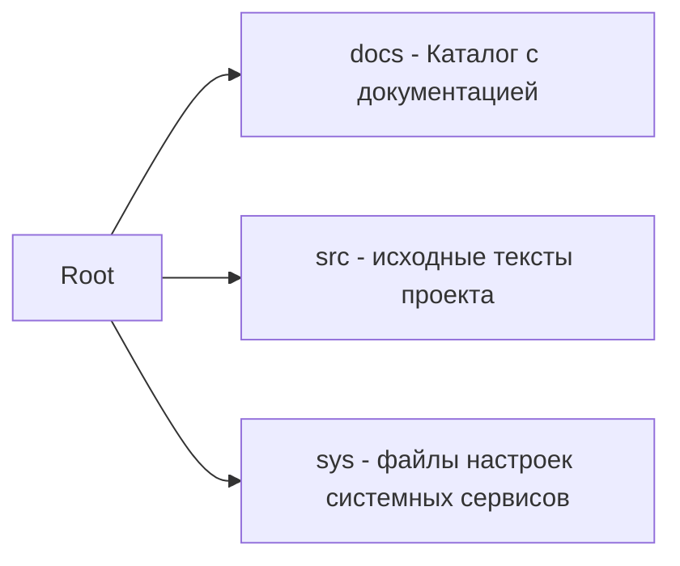

### Схема проекта c документацией и правилами 

IS#28.1 - Система оценки речевых коммуникаций

```mermaid
graph LR;

Root-->docs[docs - Каталог с документацией]
Root-->src[src - исходные тексты проекта]
Root-->sys[sys - файлы настроек системных сервисов]
```
