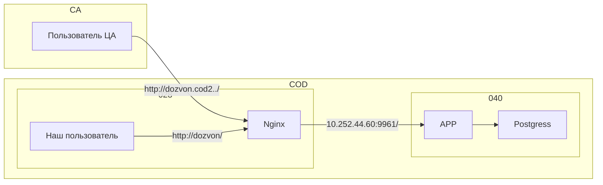

# Архитектура

## Текущая (2024-08-09) конфигурация 

Сайт: dozvon

Архитектура состоит из следующих узлов
* Входной прокси
* Сервер приложений
* База данных

Входной прокси размещен на APP028

Сервер приложений и база данных - на APP040

