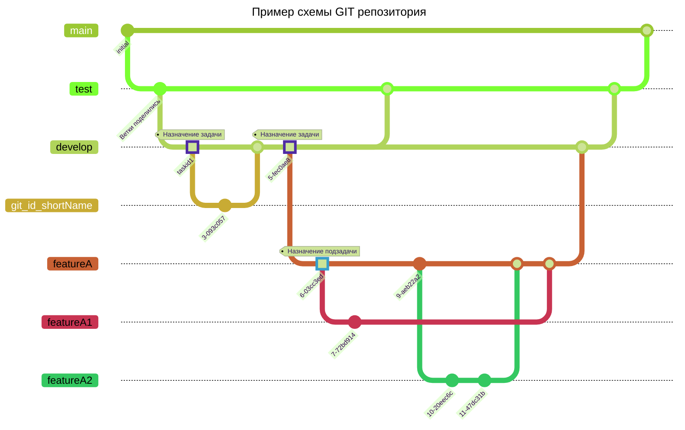

<h1 align="center">Соглашение для разработчиков по GIT</h1>
<h3 align="center">Основные принципы работы в репозитории</h3>

### Ветки, на которых делается сборка
Основная ветка main используется только для размещения на сервере прод
test - ветка для тестового сервера

### Ветки разработки
develop - основная ветка разработчиков

Все ветки выше защищены от merdge в соответствиями с ролями участников проекта

#### Ветки задач
Формируются по принципу id_Задачи_краткое описание
Id задачи находится во внутреннем GIT

После того, как задача выполнена, разработчик создает PULL Request в ветку DEVELOP. НЕ ЗАБЫВАЕМ кратко описывать что сделано и есть-ли какие-то проблемы. НУ или крепить ссылку на задачу, по которой велись работы

Остальные участники проекта проверяют предложенные исправления и пишут на них рецензии.

Если разработчик не согласен с предлагаемыми изменениями, он должен написать причину своего несогласия.

В случае принятия или по своему усмотрению (крайний случай) ответственный производит merdge.

На ветке разработки производится апдейт версии, после чего команде следует приступать к другим задачам, производя ветвление от ветки разработки.

Сборку проекта следует производить на ветках серверов.

#### Хотфиксы
Правила аналогичны веткам задач.

## Gitignore
В репозиторий не должны попадать файлы виртуального окружения, файлы модулей и прочего.

По возможности, следует исключать попадание и иных статических файлов, если их наличие не влияет на работу проекта.
